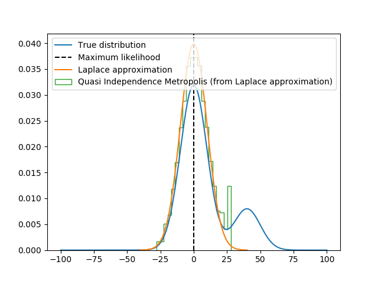
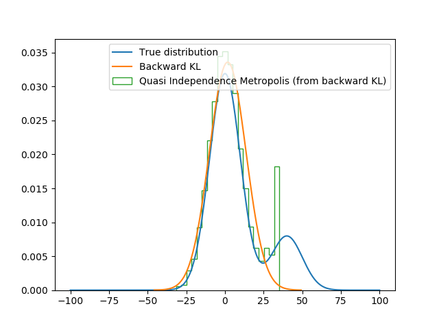
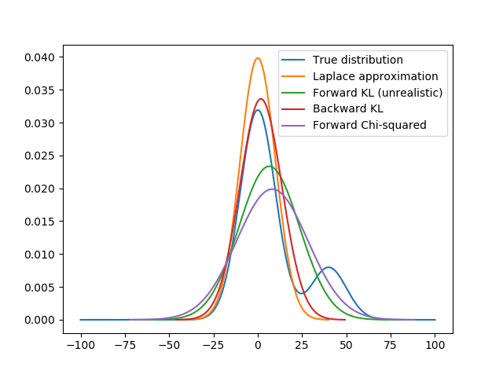
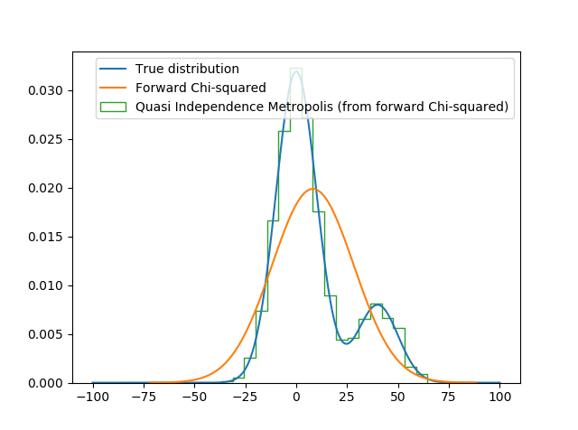

# Variational inference with MCMC
This repo aims to explore using MCMC, or more specifically independence metropolis,
after variational inference. There are two main ideas with IM that are interesting:
* Allows quasi-random sampling (e.g. halton sequence)
* Can reuse samples so the (often expensive) function does not have to be evaluated
  repeatedly

## Quasi-random sampling
Instead of drawing random samples from the variational approximation, a low-discrepancy
sequence is used instead. See [Quasi-Monte carlo](https://en.wikipedia.org/wiki/Quasi-Monte_Carlo_method)
for more information.

## Reuse samples
This idea is only possible since the samples are drawn independently in IM. After
drawing a number of samples from the distribution make the assumption that these
samples approximate the distribution sufficiently well.

In MCMC the samples are rejected/accepted with some probability but since IM samples
are independent we could have drawn them in any order. Therefore we can shuffle the
samples and reuse them in different orders. Like the name MCMC implies, this is actually
a markov chain and we are seeking its stationary distribution (i.e. the probability of
drawing each sample given the approximation that these samples are the only ones possible).

The analytical solution is therefore to create the transition matrix and solve for the
stationary state.

This has probably been used previously but I have not seen it.

## Laplace approximation
A simple and cheap way of approximating the distribution of the model
parameters is to use the Laplace approximation that leverages the
MLE estimate + second order derivatives. This can be used after estimating
a model in the classical way.

Samples from the distribution can further be improved by using IM.

It is directly apparent that in this test case, the approximating distribution
does not cover the true distribution sufficiently well for IM to be able to do
a good job.

## Kullback-Leibler divergence
The classical variational inference objective is the backward KL divergence.

We can see that it does a slightly better job of covering the true distribution
but it does not work well with IM either.

## Objective comparison
There are many possible objectives in VI. For this case where we want the approximating
distribution to cover the true distribution we would have liked to use forward KL
but it is not plausible to do so. There are some alternatives however, and in the graph
below you can see forward Chi-squared and how it compares.

You can read more about [VI with Chi-squared here](https://arxiv.org/pdf/1611.00328.pdf) and 
[other alternatives objectives here](https://en.wikipedia.org/wiki/F-divergence)

## Forward Chi-squared
In the graph below you can see Chi-squared used for this test case.

